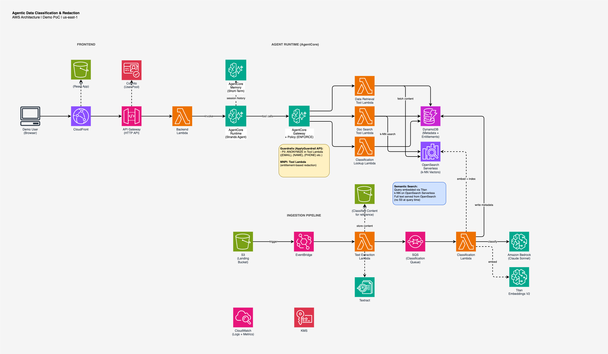

# Agentic Data Classification and Redaction

> **Important:** This project is a reference implementation and demonstration sample. It is intended for educational and prototyping purposes only and is **not intended for direct production use**. Use it as a starting point to understand patterns for agentic data classification and redaction on AWS. Review and adapt the code, security controls, and configurations to meet your organization's production requirements before deploying in any production environment.

Automated classification of unstructured content (emails, transcripts, web articles, documents) for **MNPI**, **PII**, and **security sensitivity** — enabling AI agents to safely consume, process, and produce information with bidirectional enforcement.

## Architecture



### Two Pipelines

**1. Classification Pipeline (async, at ingestion)**
```
PDF Upload → S3 Landing → EventBridge → Text Extraction Lambda (Textract)
  → SQS → Classification Lambda (Bedrock Claude) → DynamoDB (metadata)
                                                  → Titan Embeddings (embed)
                                                  → OpenSearch Serverless k-NN (index full text + vector)
                                                  → S3 Processed (audit copy)
```

**2. Agent Runtime (sync, at query time)**
```
User → CloudFront → API Gateway → Backend Lambda (thin proxy)
  → AgentCore Runtime (Strands Agent + Memory)
      → Agent reasons about the query
      → Agent calls tools via AgentCore Gateway
          → Guardrails (PII suppression, prompt attack block)
          → Tool Lambdas (semantic search via OpenSearch, MNPI redaction via entitlements)
      → Agent receives redacted results
      → Agent summarizes, answers, remembers context
  → Response back to user
```

Note: The backend Lambda is a thin proxy — all intelligence (search, reasoning, summarization, memory) lives in the agent. S3 is only used in the ingestion pipeline.

### Key Services

| Service | Purpose |
|---------|---------|
| Amazon Bedrock (Claude Sonnet) | Content classification (MNPI/PII/security level) |
| Amazon Bedrock (Titan Embeddings V2) | Document and query embedding (1024-dim vectors) |
| OpenSearch Serverless (Vector Search) | Semantic k-NN search + full content storage (single query-time data source) |
| Amazon Textract | PDF text extraction |
| AgentCore Runtime | Hosts the Strands SDK agent |
| AgentCore Gateway + Policy | Routes tool calls with Guardrails enforcement |
| AgentCore Memory | Short-term session memory for multi-turn conversation |
| Bedrock Guardrails | PII masking via ApplyGuardrail API (ANONYMIZE action) |
| DynamoDB | Classification metadata + user entitlements |
| S3 | Ingestion pipeline storage (landing + audit copy of extracted text) |
| EventBridge + SQS | Event-driven classification pipeline |
| CloudFront + S3 | Frontend hosting |
| API Gateway | Backend HTTP API for frontend |
| Cognito | Demo user authentication |
| KMS | Encryption at rest |
| CloudWatch | Logs, metrics, dashboard |

### Enforcement Model

| Concern | Mechanism | Layer |
|---------|-----------|-------|
| PII (email, SSN, phone) | Bedrock Guardrails `ApplyGuardrail` API (ANONYMIZE) | Tool Lambda |
| Prompt injection | Guardrails `PromptAttack` + `forbid` | AgentCore Gateway |
| MNPI (domain-specific) | Paragraph-level redaction per wall-crossing | Tool Lambda |
| Security level access | User clearance filter on k-NN search | Tool Lambda |
| Fail-closed | No classification = no access | Tool Lambda |
| Semantic search | Titan Embeddings + OpenSearch k-NN | Tool Lambda |
| Reasoning & summarization | Agent system prompt + Claude | AgentCore Runtime |
| Multi-turn memory | AgentCore Memory (short-term sessions) | AgentCore Runtime |

## Demo Users

| User | Role | Security Level | MNPI Cleared | PII Access |
|------|------|---------------|--------------|------------|
| Alice Chen | Portfolio Manager | Restricted | ACME, TechStart, GlobalTech, NovaTech | No |
| Bob Martinez | Research Analyst | Restricted | ACME, TechStart | No |
| Carol Davis | Compliance Officer | Restricted | All entities | Yes |
| Dave Wilson | Summer Intern | Internal | None | No |
| Eve Johnson | HR Manager | Restricted | None | Yes |

## Prerequisites

- AWS CLI v2 configured with credentials
- Node.js 18+ and npm
- Python 3.13+
- Docker (for building the agent container image, ARM64)
- Bedrock model access enabled in us-east-1 for:
  - Claude Sonnet 4.6 (classification + agent)
  - Titan Embeddings V2 (document/query embedding)

## Deployment

### One-Command Deploy

```bash
./scripts/deploy.sh demo
```

This single script deploys **everything** via CloudFormation:
1. Builds and pushes the agent container to ECR (ARM64)
2. Packages and uploads Lambda functions to S3
3. Deploys the base infrastructure CloudFormation stack:
   - Ingestion pipeline (S3, EventBridge, Textract, SQS, Classification Lambda)
   - Storage (DynamoDB, OpenSearch Serverless)
   - Agent tools (Data Retrieval, Document Search, Classification Lookup Lambdas)
   - Frontend hosting (CloudFront, S3, API Gateway, Cognito)
   - Monitoring (KMS, CloudWatch)
4. Deploys the AgentCore CloudFormation stack (two-phase):
   - AgentCore Runtime (Strands agent with Claude, ECR container)
   - AgentCore Gateway + Policy Engine (Guardrails enforcement)
   - AgentCore Memory (short-term session history)
   - Gateway Targets (tool Lambdas exposed via MCP)
5. Configures Runtime environment (Gateway URL, Memory ID)
6. Seeds user entitlement policies
7. Builds and uploads the React frontend
8. Uploads sample PDFs to trigger the classification pipeline

### Step-by-Step (if needed)

```bash
# 1. Build and push agent container to ECR (ARM64 required by AgentCore)
cd agent
aws ecr get-login-password --region us-east-1 | docker login --username AWS --password-stdin <account-id>.dkr.ecr.us-east-1.amazonaws.com
docker build --platform linux/arm64 -t data-classification-demo-agent:latest .
docker tag data-classification-demo-agent:latest <account-id>.dkr.ecr.us-east-1.amazonaws.com/data-classification-demo-agent:latest
docker push <account-id>.dkr.ecr.us-east-1.amazonaws.com/data-classification-demo-agent:latest

# 2. Package Lambda functions and upload to S3
# (deploy.sh handles this automatically — zips each Lambda with deps)

# 3. Deploy base infrastructure (CloudFormation)
cd infra && aws cloudformation deploy --template-file template.yaml \
  --stack-name data-classification-demo --region us-east-1 \
  --capabilities CAPABILITY_NAMED_IAM --no-fail-on-empty-changeset \
  --parameter-overrides LambdaCodeS3Bucket=<lambda-code-bucket>

# 4. Deploy AgentCore stack (two-phase: without targets, then with targets)
aws cloudformation deploy --template-file template-agentcore.yaml \
  --stack-name data-classification-demo-agentcore --region us-east-1 \
  --capabilities CAPABILITY_NAMED_IAM --parameter-overrides \
  AgentEcrUri=<ecr-uri> DeployTargets=false ...
# Then re-deploy with DeployTargets=true

# 5. Configure Runtime env vars (Gateway URL + Memory ID)
aws bedrock-agentcore-control update-agent-runtime --agent-runtime-id <id> ...

# 6. Seed entitlements
python3 scripts/seed-entitlements.py demo

# 7. Build and deploy frontend
cd frontend && npm install && npm run build
aws s3 sync dist/ s3://<frontend-bucket>/ --delete

# 8. Upload sample data
./scripts/upload-sample-data.sh demo
```

### Accessing the Demo

After deployment, the CloudFront URL is printed. **Wait ~2 minutes** for the classification pipeline to finish processing the 5 sample PDFs (extraction → classification → embedding → indexing). Then open the URL in a browser.

1. Select a user persona from the dropdown
2. Ask natural language questions (semantic search — no exact keywords needed)
3. Ask follow-up questions — the agent remembers conversation context within a session
4. Switch users to see how the same content is redacted differently (session resets on user change)
5. Check the Classification Dashboard for pipeline status
6. Review the Access Decision Log for audit trail

## Demo Scenarios

See [DEMO-SCRIPT.md](DEMO-SCRIPT.md) for the full walkthrough with 8 scenarios, expected responses, and talking points.

**Quick examples:**
- Alice asks "what undisclosed financial projections do we have?" → finds earnings email, full MNPI visible
- Bob asks the same → finds the same email, MNPI visible (he's cleared for ACME)
- Bob asks "show me the expert call about infrastructure spending" → finds transcript, GlobalTech/NovaTech MNPI redacted
- Dave asks anything about earnings → nothing found (Restricted docs hidden from Internal clearance)
- Carol sees everything unredacted (compliance access)

## Project Structure

```
├── infra/                      # CloudFormation (SAM) template
│   └── template.yaml          # Full stack: S3, DynamoDB, OpenSearch, Lambda, API GW, CloudFront
├── lambdas/
│   ├── text-extraction/        # Extracts text from PDFs via Textract
│   ├── classification/         # Classifies (Bedrock Claude) + embeds (Titan) + indexes full text (OpenSearch)
│   ├── data-retrieval-tool/    # Gateway target: retrieve from OpenSearch with entitlement check
│   ├── document-search-tool/   # Gateway target: semantic k-NN search via OpenSearch
│   ├── classification-lookup-tool/  # Gateway target: metadata lookup from DynamoDB
│   └── backend-api/            # Thin proxy: invokes AgentCore, serves dashboard endpoints
├── agent/                      # Strands SDK agent (the intelligence layer) for AgentCore Runtime
├── frontend/                   # React (Vite) demo UI
├── sample-data/                # Sample PDFs (generated by script)
├── scripts/
│   ├── deploy.sh              # One-command full deployment (everything via CloudFormation)
│   ├── generate-sample-pdfs.py # Creates demo PDFs
│   ├── seed-entitlements.py   # Seeds user entitlement policies
│   └── upload-sample-data.sh  # Uploads PDFs to trigger pipeline
├── architecture-diagram.drawio # AWS architecture diagram
├── architecture-diagram.png    # Exported PNG of architecture
├── DEMO-SCRIPT.md             # Demo walkthrough with test prompts
└── .kiro/specs/                # Spec documents (requirements, design, tasks)
```

## Cleanup

```bash
./scripts/teardown.sh demo
```

This removes everything: both CloudFormation stacks, ECR repository, S3 buckets, and all data. To see what it does step by step:

```bash
# Or manually:
# 1. Delete AgentCore stack first (depends on base stack outputs)
aws cloudformation delete-stack --stack-name data-classification-demo-agentcore --region us-east-1
aws cloudformation wait stack-delete-complete --stack-name data-classification-demo-agentcore --region us-east-1

# 2. Delete base infrastructure stack (includes OpenSearch Serverless collection)
aws cloudformation delete-stack --stack-name data-classification-demo --region us-east-1
aws cloudformation wait stack-delete-complete --stack-name data-classification-demo --region us-east-1

# 3. Delete ECR repository and Lambda code bucket
aws ecr delete-repository --repository-name data-classification-demo-agent --region us-east-1 --force
aws s3 rb s3://data-classification-demo-lambda-code-<account-id> --force
```

## Cost Estimate (Demo)

Running this demo with 5 sample documents:
- Bedrock Claude (classification): ~$0.10/doc × 5 = $0.50
- Bedrock Titan Embeddings: ~$0.001/doc × 5 = negligible
- OpenSearch Serverless: ~$0.24/hr (minimum 2 OCUs for vector search) = ~$6/day
- Lambda: Minimal (free tier)
- DynamoDB: Minimal (on-demand, free tier)
- S3 + CloudFront: Minimal

Total estimated cost: **~$6-8/day** while OpenSearch collection is active. Delete the stack when not demoing.
